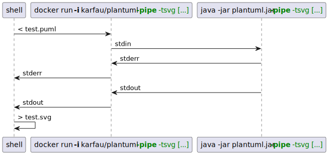

# plantuml-docker

Provides the source code for the [karfau/plantuml](https://hub.docker.com/r/karfau/plantuml) docker image.

It offers the ability to use [plantuml](https://plantuml.com) as a cli tool based on docker.

To build the image you need to have java installed, since we are making use of [gradle](https://gradle.org/) to manage the plantuml dependency.
[Renovate](https://www.whitesourcesoftware.com/free-developer-tools/renovate/) is configured to update dependencies in an automated manner.

## Usage

**&TLDR;**

You should be able to replace `java -jar plantuml.jar` in a command with `docker run karfau/plantuml[:VERSION]` in your script. 

**More details:**

As you can see in [test-docker.sh](./test-docker.sh) running the above command without any arguments renders the help output that can also be read online at the end of [this page](https://plantuml.com/command-line)

Input and output of course follows the docker rules, and there is currently no mount point prepared to make working with files easier (PRs welcome!). 
So either you mount a directory yourself and provide the related parameters, 

or you use `-p[ipe]` argument to use stdin and stdout (as in [test-docker.sh](./test-docker.sh)):

or you make use of the new [`-picoweb[:port]`](https://plantuml.com/picoweb) option together with `-encode` and `-decode`.

If you found a way how to use the image, feel free to provide a PR that modifies `test-docker.sh` so it's part of the tests. I will also do that alongside making use of the image.

## Contribute

To build the image run `./build-docker.sh` and make sure `JAVA_HOME` is set for the gradle wrapper to work.
Run `./test-docker.sh` to see if everything still works as expected.

## Related

Source of inspiration for the docker image:
- https://www.github.com/lindt/docker_plantuml
- https://forum.plantuml.net/11186/please-publish-official-docker-supports-headless-operation?show=11186#q11186

Planning to use this in https://github.com/karfau/xstate-plantuml
